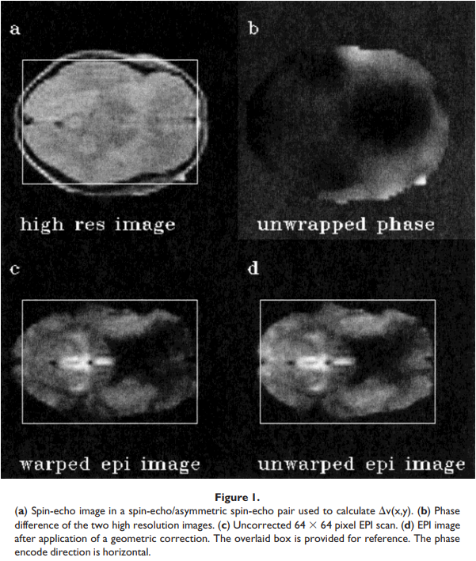

### Sources of Distortion in Functional MRI Data

[**paper**](http://invibe.net/biblio_database_dyva/woda/data/att/9f9f.file.pdf)

#### Abstract
> Functional magnetic resonance image (fMRI) experiments rely on the ability to detect subtle signal changes in magnetic resonance image time series. Any areas of signal change that correlate with the neurological stimulus can then be identified and compared with a corresponding high-resolution anatomical scan. This report reviews some of the several artefacts that are frequently present in fMRI data, degrading their quality and hence their interpretation. In particular,the effects of magnetic field inhomogeneities are described, both on echo planar imaging (EPI) data and on spiral imaging data. The modulation of these distortions as the subject moves in the magnet is described. The effects of gradient coil nonlinearities and EPI ghost correction schemes are also discussed.

功能磁共振成像(fMRI)实验依赖于检测磁共振图像时间序列中的细微信号变化的能力。与神经刺激相关区域的信号变化可以被检测到并反映在一张对应的高分辨率的解剖影像上。这篇报告回顾了一些经常出现在功能磁共振成像数据中的伪影，这些伪影降低了影像的质量，从而降低了它们的解释。特别是磁场不均匀性对回波平面成像(EPI)数据和螺旋成像数据的影响。被试在磁体中移动所造成的畸变也进行了描述。讨论了梯度线圈非线性和EPI虚影校正方案的影响。

**实际上，这篇文章我自己只关注了epi影像受到非均匀场影像产生的几何扭曲以及头动造成的几何扭曲。**

由于所有梯度线圈产生线性梯度场的能力不足，所有的磁共振脉冲序列都会有一定的空间畸变。

#### Effects of gradient coil nonlinearities

- fMRI中完美的场梯度线圈应该有如下的性质：
  - high gradient strength(> 30mT/m)
  - fast switching (> 200 T/m/s)
  - low nonlinearity (< 1%)
  - low acoustic noise (< 80 dBA)
  
  在实践中这样的参数很难达到，通常为了获得高梯度强度和快速的切换，线圈的线性特性会受到一定程度上的影响。

- 这样的非线性效应会影响所有的MRI序列，无论是传统的还是超快的。这样的结果将会扭曲影像的形状同时导致切片的选择发生在稍微弯曲的表面上，而不是直线切片上。大多数体梯度线圈是40cm的球体，小于1%的线性度。然而，应该注意的是，1%的梯度误差可以转换为更显著的位置误差，因为位置误差等于$\int{G_x}dx$，其中$G_x$为x方向上的场梯度。

- 在头部插入线圈中，这样的畸变可能会更严重，这是由于这些线圈较低的线性性质规范

- 平面内畸变的校正可以通过对预先校准的位置误差展开来实现。许多制造商在图像重建过程中都会进行这种操作。

#### Effect of magnetic field inhomogeneities on EPI data
1. 在一定程度上，可以将偏置电流置于线圈上，使整个样品的静态磁场变得均匀
2. 但是不管怎样，在靠近组织空气和组织软骨边界的地方，磁场的非均匀性依旧存在

- 平面回波技术在相位编码方向上的带宽很低。通常，每个像素的带宽小于20Hz，这意味着100Hz的局部补偿不均匀性可能会导致信号在该区域的定位错误5 pixels.
  >Typically, the bandwidth per pixel is ,20 Hz, which implies that a local shim inhomogeneity of 100 Hz (as is quite typical close to the frontal sinuses at 3.0 Tesla) can lead to a mis-location of the signal in that region by 5 pixels

- 另外，如果在短距离内场匀质性变化较快的话，可能会出现信号丢失或者高信号区域
  > Additionally, when the field homogeneity varies rapidly over a short distance, there may be loss of signal(gradient echo sequences) or hyperintense regions(spin echo sequences)

- 尽管总信号强度的变化很难补偿（使得EPI在额叶与颞叶区域的成像存在问题），但有可能对pixel的错误定位进行纠正
  > Although the gross signal intensity changes are difficult to compensate for (making EPI imaging of the frontal and temporal lobes problematic), it is possible to correct substantially for the pixel mis-location [Jezzard and Balaban, 1995].

- 可以注意到像素在影像读出方向上的错位是可以忽略的，因此该问题可以看作是在相位编码方向上的一系列一维像素位移：
  $$x=x_0 + \Delta v(x)/BW_{pe} \tag{1}$$
  其中，$x$是错误定位的位置，$x_0$是正确的位置，$\Delta v(x)$是以HZ为单位的静态磁场的空间分布，并且$BW_{pe}$是相位编码方向上每个pixel的bandwidth

##### fieldmap的计算以及distortion correction
- 图Figure1.a展示了在spin-echo/asymmetric spin-echo pair中的spin-echo image, 这幅影像是在fMRI研究之前收集的，用于计算场图(field map)的分布(the $\Delta v(x)$ term)
- 场图是通过计算两张高分辨率的影像的相位差得到的：
  $$\Delta v(x,y) = \Delta \phi(x,y)/(2\pi\Delta TE) \tag{2}$$
  - 其中$\phi(x,y)$是相位的空间分布
  - $\Delta TE$是spin-echo/asymmetric spin-echo pair的回波时间差

- 计算完场图后，利用公式(1)对epi影像进行校正

- 图1b显示了最终的相位图在轴向切片中的分布。图1c显示了未经校正的$64\times64$像素回波平面扫描。图1d显示了EPI图像经过几何校正

#### Head motion in an inhomogeneous field
- 在fMRI研究过程中，头部的轻微运动可以导致图像时间序列中的大量信号变化，而这些变化将掩盖正在研究的细微信号变化。

- 越来越多的文献提出当被试发生头动时，如何重新调整图像的问题。
  - 大多数研究者使用刚体变换（6个参数）或仿射变换（12个参数）
  - 但是这两种变换都不能解决当被试在非均匀场中移动时，图像可能发生的局部形变

- 实际上，将公式2应用于fMRI序列中的各个时间点，可以纠正局部非线性畸变
  - 有必要知道场图偏差随时间的函数。
    >  it is necessary to know the field map deviation as a function of time.
  - 这些信息一般可以直接从梯度回波EPI数据本身的相位信息中得到。
  - 如果相位信息保留了的话，那么场图可以通过$\Delta v(x,y) = \Delta \phi(x,y)/(2\pi\Delta TE)$ 计算得到，其中$\Delta \phi(x,y)$ 是时间点n到时间点1之间的相位差，TE是梯度回波时间
  - 最后将标准的运动校正参数应用到场偏差图中，然后将公式2应用在EPI数据上，可以消除EPI数据中的局部畸变